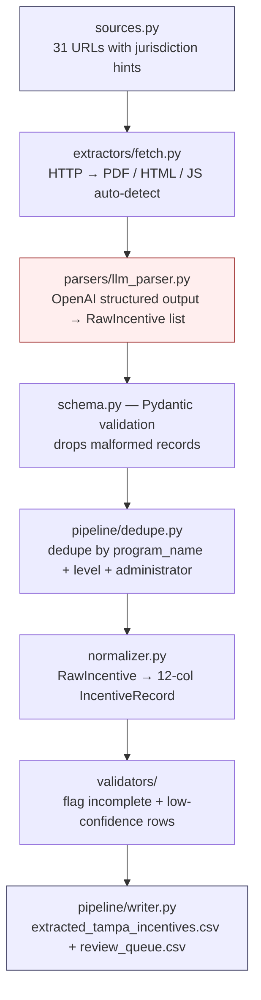

# Dreamline AI — Tampa Incentives Scraper

This pipeline produces `extracted_tampa_incentives.csv` — a list of housing
and clean-energy incentive programs available to property owners in the
Tampa Bay area. Every record comes from a live fetch of a public web page
followed by LLM extraction into a Pydantic schema. There is no hand-typed
program data anywhere in the codebase.

## Quick start

```bash
python3 -m venv .venv
source .venv/bin/activate
pip install -r requirements.txt
python -m playwright install chromium   # for JavaScript-heavy pages

cp .env.example .env                    # add your OPENAI_API_KEY

python -m dreamline_scraper.cli run -v  # produce the CSV
python scripts/quality_gate.py          # run quality checks
pytest                                  # run unit tests
```

Outputs:

- `output/Extracted_Tampa_Incentives/extracted_tampa_incentives.csv` — the
  deliverable, in the exact 12-column order required by the brief.
- `output/logs/review_queue.csv` — every record flagged for human review,
  with the reasons appended to the `eligibility_criteria` field.
- `output/logs/run_<timestamp>.jsonl` — one line per source with the URL,
  character count of fetched text, number of records produced, and timing.
  This is the audit trail.

## How it works

The pipeline is intentionally short: every source goes through the same
five steps, no exceptions. Adding a new source means adding one entry to
[`sources.py`](src/dreamline_scraper/sources.py) — no new code.



### What each step does (non-technical)

1. **Where to look.** [`sources.py`](src/dreamline_scraper/sources.py) is a
   simple list of public URLs (IRS, FEMA, Florida DOR, county housing
   portals, TECO, Duke, Peoples Gas, etc.) plus a hint about the level
   (federal / state / county / city / utility) and the jurisdiction. The
   hint helps the LLM ground its extraction and fills in default values
   when the page itself doesn't repeat them.
2. **Fetch.** [`extractors/fetch.py`](src/dreamline_scraper/extractors/fetch.py)
   tries a polite HTTP request first (1 request/second per host, 30-second
   timeout, retries on transient failures). If the page is empty or
   JavaScript-rendered, it falls back to a headless Chromium browser. PDFs
   are detected by content-type and parsed with `pdfplumber`. The output is
   plain text — the LLM doesn't need to know the transport.
3. **LLM extraction.** [`parsers/llm_parser.py`](src/dreamline_scraper/parsers/llm_parser.py)
   sends the text plus the jurisdiction hints to OpenAI with a JSON-schema
   `response_format`. The model returns a list of programs in a fixed
   schema. The system prompt forbids inferring amounts or deadlines that
   aren't in the page.
4. **Validate + dedupe.** [`schema.py`](src/dreamline_scraper/schema.py)
   Pydantic-validates each record (drops anything missing `program_name`).
   [`pipeline/dedupe.py`](src/dreamline_scraper/pipeline/dedupe.py) removes
   duplicates that appear on more than one page.
5. **Normalize + write.** [`normalizer.py`](src/dreamline_scraper/normalizer.py)
   flattens each 17-field internal record into the 12-column CSV row the
   brief asks for, including mapping internal types (`tax_credit`, `grant`,
   `rebate`, ...) into the five required `incentive_type` values.
   Records that fail the [completeness](src/dreamline_scraper/validators/completeness.py)
   or [sanity](src/dreamline_scraper/validators/sanity.py) checks get
   `review_needed = "Yes"` with the reason written into the
   `eligibility_criteria` field for the reviewer to read.

## Reviewer-facing answers to common questions

These three came up in the first review pass (Anirudh, May 2026). The
answers below describe the current pipeline so a future reviewer can find
them up front:

### Where does the program data come from?

Every row's `program_links` column is the URL the LLM read to produce that
row, and every record carries `extraction_source = "llm"` for provenance.
There is no curated baseline anymore — the previous `scrapers/_curated.py`
and `scrapers/_curated_expanded.py` files have been removed. Source
selection is documented in [`docs/SOURCE_SELECTION.md`](docs/SOURCE_SELECTION.md).

If a row looks wrong, click the link in `program_links` to see exactly the
page the LLM read.

### What about dead or outdated links?

Three layers of defense:

1. **Audit log per run.** `output/logs/run_<timestamp>.jsonl` lists every
   source with the number of characters fetched and number of records
   produced. A source with `text_chars: 0` or `records: 0` is a fetch
   problem you can investigate immediately.
2. **Optional URL liveness check.** `python -m dreamline_scraper.cli run --check-links -1`
   sends a HEAD request to every `program_links` URL and marks broken
   ones for review. Default is off so offline runs don't generate false
   positives.
3. **Low-confidence flagging.** The LLM is asked to assign a
   `confidence_score` between 0 and 1. Anything below 0.7 is flagged for
   review automatically. Records on pages with very little extracted text
   (likely SPAs that didn't render) get a low confidence and surface in
   the review queue.

### Why is it easier to investigate data quality now?

Previously there were 14 per-source scraper files, each with its own
extraction logic — so when a field looked wrong, you had to find the
specific scraper, understand its bespoke parsing, and trace where the
field came from. Today there is **one** extraction path, **one** prompt
([parsers/prompts.py](src/dreamline_scraper/parsers/prompts.py)), and
**one** validation layer. To debug a row:

1. Look at `extraction_source` (always `llm` now).
2. Open the URL in `program_links`.
3. Compare what the page says against the row.
4. If the model misread, the fix is to clarify the prompt; if the page
   itself is misleading, flag for human review.

## Adding a new source

Add one `Source(...)` entry to [`sources.py`](src/dreamline_scraper/sources.py):

```python
Source(
    name="My Source — Program Page",
    url="https://example.gov/programs",
    level="state",          # federal | state | county | city | utility
    state="FL",
    county="Hillsborough",  # optional
    city="Tampa",           # optional
    utility="TECO",         # optional
    render="auto",          # auto | static | js
    wait_selector="main",   # optional, for SPAs
    timeout_ms=45_000,      # optional override
)
```

The pipeline picks it up automatically next run.

For dynamic source discovery in the future (an agent that finds new
program pages on its own — see brief §14.4), the natural extension is a
`discoverer/` module that writes proposed sources to a `candidates.yaml`
queue that a human promotes into `sources.py`. Keeping `sources.py`
human-curated protects against the discovery agent proposing dead URLs
or marketing pages.

## CLI

```bash
# Run all sources
python -m dreamline_scraper.cli run -v

# Run a subset (substring match on source name, case-insensitive)
python -m dreamline_scraper.cli run --source "IRS" --source "TECO" -v

# Add extraction_source column to the output CSV
python -m dreamline_scraper.cli run --include-source

# HEAD-check every program_links URL and flag broken ones for review
python -m dreamline_scraper.cli run --check-links -1

# Just list the configured sources
python -m dreamline_scraper.cli list-sources
```

## Output schema

Per `resources/Incentive Data Extraction Info-converted.md`:

```
program_name, state, city, incentive_type, property_type, description,
eligibility_criteria, incentive_amount, valid_until, updated_at,
review_needed, program_links
```

`incentive_type` is constrained to `Grants | Rebates | Finance Solutions |
Tax Credits | Investments`. `review_needed` is `Yes` or `No`. `valid_until`
is an ISO date, `Ongoing`, or `Unknown`. `updated_at` is the ISO date of
the run.

## Repository layout

```
src/dreamline_scraper/
  sources.py                      list of URLs to scrape (the only place
                                  the scraper learns where to go)
  schema.py                       RawIncentive (17 fields) + IncentiveRecord
                                  (12-col CSV) Pydantic models
  normalizer.py                   RawIncentive → IncentiveRecord
  config.py                       environment-driven settings
  cli.py                          argparse entry point

  extractors/
    fetch.py                      unified fetcher (HTML / PDF / JS)
    http.py                       polite HTTP session (1 rps, retries, cache)
    html.py                       BeautifulSoup helpers
    pdf.py                        pdfplumber wrapper
    playwright_runner.py          Chromium fallback for JS-heavy pages

  parsers/
    llm_parser.py                 OpenAI structured-output wrapper
    prompts.py                    system + user prompts + response JSON schema

  pipeline/
    orchestrator.py               for each source: fetch → llm.parse →
                                  dedupe → normalize → CSV
    dedupe.py                     dedupe key: (program_name, level, admin)
    writer.py                     CSV writer in exact column order

  validators/
    completeness.py               flag rows missing required CSV columns
    sanity.py                     amount sanity + optional URL liveness

scripts/quality_gate.py           assertions over the final CSV
tests/                            unit tests (pytest)
resources/                        the original brief + extraction spec
```

## Quality gates

`scripts/quality_gate.py` asserts on the produced CSV:

- Header is exactly the 12 required columns in order.
- `incentive_type` uses only the five allowed values.
- `review_needed` is `Yes` or `No`.
- `program_links` is populated and begins with `http`.
- `program_name` is non-empty.
- `updated_at` is ISO format.
- Total records ≥ 60.

## Extended documentation

- [`docs/PIPELINE.md`](docs/PIPELINE.md) — end-to-end workflow, CSV column
  provenance, fetch strategies, and how to debug a bad row.
- [`docs/SOURCE_SELECTION.md`](docs/SOURCE_SELECTION.md) — how `sources.py`
  was chosen vs. the kickoff brief, P0/P1/P2 mapping, and review cadence.

Validate configured source URLs:

```bash
PYTHONPATH=src python scripts/validate_sources.py
```

## Reference materials

- `resources/Dreamline_AI_Brief_Incentives_Process-converted.md` — the
  strategic brief and 4-phase AI-agent roadmap.
- `resources/Incentive Data Extraction Info-converted.md` — the concrete
  CSV task specification (column order, vocabulary, sources).
