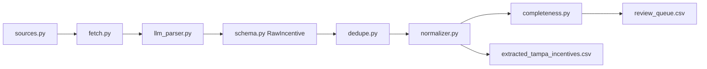

# Pipeline workflow — field-level reference

This document answers reviewer questions about **how each CSV column is produced** now that the codebase uses a **single** extraction path (no per-site scraper classes).

## End-to-end flow

| Step | Module | Input | Output |
| --- | --- | --- | --- |
| 1 | `sources.py` | — | URL + jurisdiction hints |
| 2 | `extractors/fetch.py` | URL, `render` hint | Plain text + `final_url` |
| 3 | `parsers/llm_parser.py` | Text + hints | `RawIncentive` list (17 fields) |
| 4 | `schema.py` | JSON | Validated `RawIncentive` (drops invalid) |
| 5 | `pipeline/dedupe.py` | Raw list | Deduped by `(program_name, level, administrator)` |
| 6 | `normalizer.py` | `RawIncentive` | `IncentiveRecord` (12 CSV columns) |
| 7 | `validators/completeness.py` | Records | Forces `review_needed=Yes` if required cols empty |
| 8 | `validators/sanity.py` | Records | Optional HEAD on `program_links` (`--check-links`) |
| 9 | `pipeline/writer.py` | Records | CSV + review queue |

## CSV column → origin

| CSV column | Primary source | Rules / transforms |
| --- | --- | --- |
| `program_name` | LLM `program_name` | Required; record dropped if missing |
| `state` | LLM + `Source.level` | Federal → `USA`; state → `FL`; county/city from hints |
| `city` | LLM + `Source.level` | Federal → `Federal`; utility → `{provider} territory` |
| `incentive_type` | LLM `type` | Mapped via `_TYPE_MAP` in `normalizer.py`; heuristic fallback on keywords |
| `property_type` | LLM `eligible_property_types` | Joined uppercase; default `All` |
| `description` | LLM `description` | Truncated 600 chars; falls back to eligibility text |
| `eligibility_criteria` | LLM eligibility fields | Ownership, AMI, projects, notes, administrator |
| `incentive_amount` | LLM `amount_*` | Formatted dollar/percent; `See program page` → review flag |
| `valid_until` | LLM `expires_at` | Federal missing expiry → review; other levels default `Ongoing` |
| `updated_at` | Run date / `last_verified_at` | ISO date of extraction |
| `review_needed` | Normalizer + completeness | `Yes` if type/amount/link/confidence issues |
| `program_links` | LLM `application_url` → `source_url` | See **Program links** below |

## Program links (dead URL mitigation)

1. **Prompt** (`parsers/prompts.py`): LLM must only emit `application_url` when an absolute URL appears on the page; otherwise null.
2. **Normalizer** (`url_utils.resolve_program_link`): Valid `application_url` wins; invalid/guessed paths fall back to `source_url` (the page actually fetched).
3. **Optional liveness** (`--check-links -1`): HEAD-check each `program_links` and flag failures for review.
4. **Audit log**: `output/logs/run_*.jsonl` — zero `text_chars` means the source fetch failed before parsing.

## Confidence and review queue

| Condition | `review_needed` |
| --- | --- |
| `confidence_score < 0.7` | Yes |
| Unresolved `incentive_type` | Yes |
| Missing amount | Yes (amount set to “See program page”) |
| Missing/invalid link | Yes |
| Federal program, unknown expiry | Yes |
| Completeness validator finds empty required field | Yes (overrides) |

Reasons are appended to `eligibility_criteria` as `[needs review: …]`.

## Fetch strategy per source

| `Source.render` | Behavior |
| --- | --- |
| `auto` (default) | HTTP GET; if text &lt; threshold → Playwright Chromium |
| `static` | HTTP only |
| `js` | Playwright with optional `wait_selector` |

PDF responses are routed to `pdfplumber`. Duke Energy hosts use a browser User-Agent (see `extractors/http.py`).

## Debugging a bad row

1. Open `program_links` in a browser.
2. Compare page text to the row.
3. If the page is correct but the row is wrong → adjust `parsers/prompts.py`.
4. If the link is wrong but the source page in `sources.py` is right → likely an invented `application_url`; confirm fallback behavior in `url_utils.py`.
5. Check `output/logs/run_*.jsonl` for the parent source’s `text_chars` and `records` count.

## Related docs

- Operator quick start: [`README.md`](../README.md)
- Source inclusion rationale: [`SOURCE_SELECTION.md`](SOURCE_SELECTION.md)
- Strategic brief (Phases 1–4): [`resources/Dreamline_AI_Brief_Incentives_Process-converted.md`](../resources/Dreamline_AI_Brief_Incentives_Process-converted.md)
